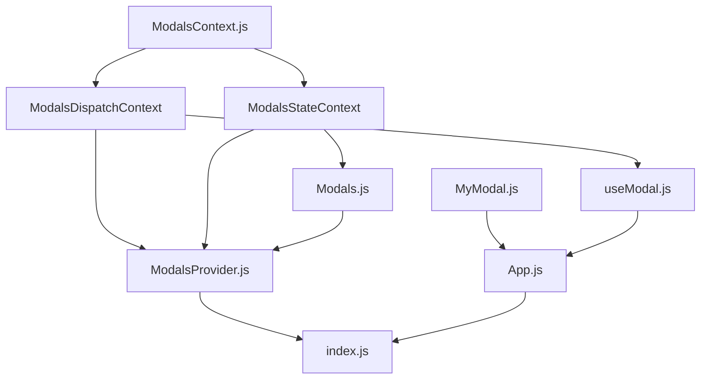

```mermaid
graph TD;
    ModalsContext.js --> ModalsDispatchContext
    ModalsContext.js --> ModalsStateContext


    ModalsProvider.js --> index.js;
    App.js --> index.js

    ModalsDispatchContext --> ModalsProvider.js
    ModalsStateContext --> ModalsProvider.js
    Modals.js --> ModalsProvider.js

    ModalsStateContext --> Modals.js

    MyModal.js --> App.js
    useModal.js --> App.js

    ModalsDispatchContext --> useModal.js
```
