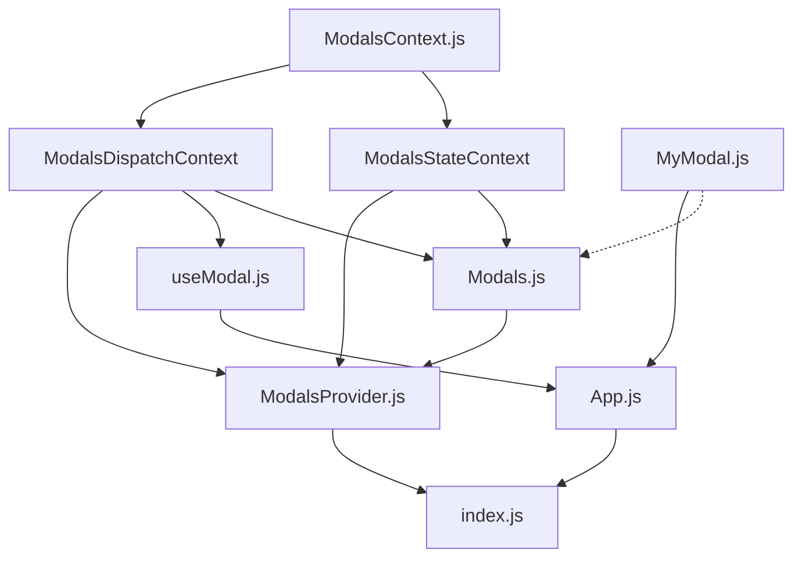

```mermaid
graph TD;
    ModalsContext.js --> ModalsDispatchContext
    ModalsContext.js --> ModalsStateContext


    ModalsProvider.js --> index.js;
    App.js --> index.js

    ModalsDispatchContext --> ModalsProvider.js
    ModalsStateContext --> ModalsProvider.js
    Modals.js --> ModalsProvider.js

    ModalsStateContext --> Modals.js

    MyModal.js --> App.js
    useModal.js --> App.js

    ModalsDispatchContext --> useModal.js

    %% Modals.js에서 state에 저장된 component를 렌더링
    MyModal.js -.-> Modals.js

    %% 확인, 취소 버튼의 함수를 전달하기 위해
    ModalsDispatchContext --> Modals.js


```
