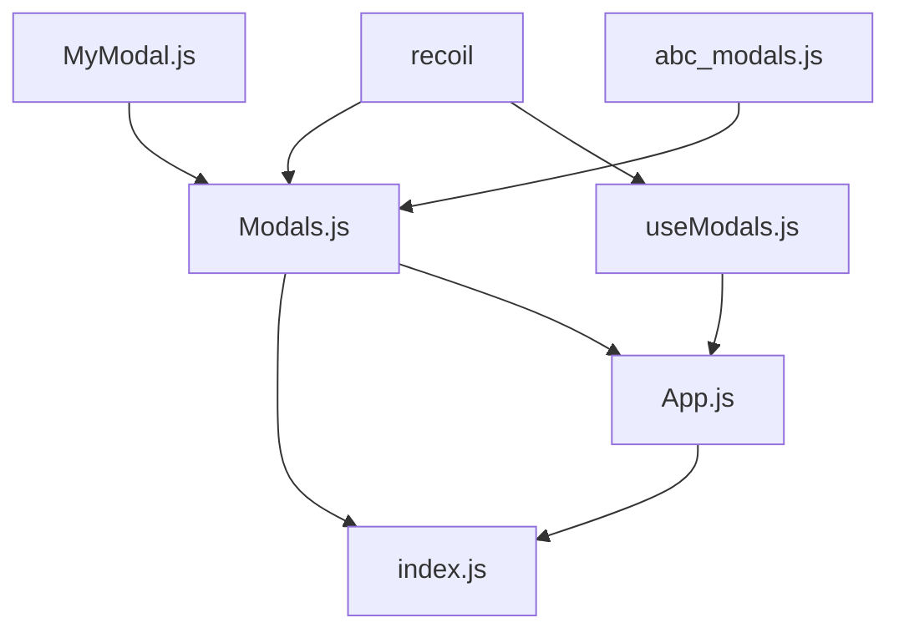

```mermaid
graph TD;

    recoil --> Modals.js
    recoil --> useModals.js

    Modals.js --> index.js;
    App.js --> index.js


    %% MyModal.js --> App.js
    useModals.js --> App.js
    Modals.js --> App.js

    %% Modals.js에서 state에 저장된 component를 렌더링
    %% MyModal.js -.-> Modals.js
    MyModal.js --> Modals.js
    abc_modals.js --> Modals.js


```
